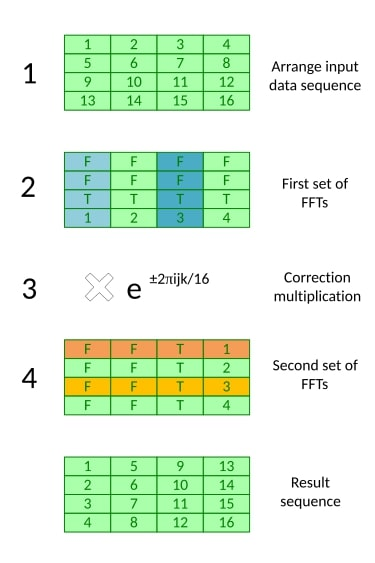
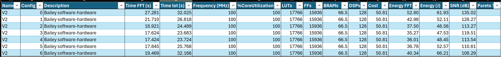
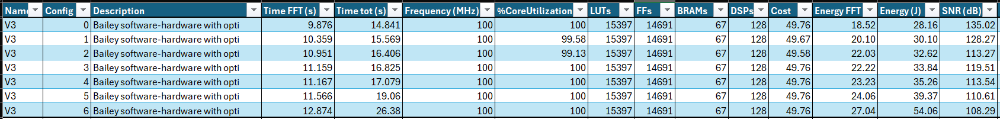

# Galactic speed project

Authors: Gaetan Jenni & Axel Juaneda 

> The goal of this project is to generate Pareto-optimal accelerator designs to process radio signals
received by the Very Elegant Galactic Antenna (VEGA) radio telescope

---

## Table of Contents

<!-- - [Design Metrics]()
- [Solution 1]() -->
- [Solution 2](https://gitlab.epfl.ch/gjenni/galactic-speed-project/-/tree/main/Versions/V2_first_accelerator?ref_type=heads)
- [Solution 3](https://gitlab.epfl.ch/gjenni/galactic-speed-project/-/tree/main/Versions/V3?ref_type=heads)

---

All the different solutions could be found inside the directory [Versions](https://gitlab.epfl.ch/gjenni/galactic-speed-project/-/tree/main/Versions?ref_type=heads).

<!-- ## Design Metrics -->

<!-- ## Solution V1: Bailey's FFT pure software

In this solution we wan't to keep a **flexibility** of 100%. Thus we need to find a way to compute large FFTs with limited ressources. 
After some researches I found about the Bailey's FFT.

> "This variation of the Cooley–Tukey FFT algorithm was originally designed for systems with hierarchical memory common in modern computers. [...] The algorithm treats the samples as a two dimensional matrix and executes short FFT operations on the columns and rows of the matrix, with a correction multiplication by "twiddle factors" in between."  
> — [Wikipedia](https://en.wikipedia.org/wiki/Bailey%27s_FFT_algorithm)

This algorithm is more cache efficient in comparison with the original one, will allow us to run FFTs on large datasets and will provide a good base for further optimizations. -->

## Solution V2: Bailey's FFT integrated with hardware

[Solution link](https://gitlab.epfl.ch/gjenni/galactic-speed-project/-/tree/main/Versions/V2_first_accelerator?ref_type=heads)

This solutions is using the Bailey's algorithm, with the FFT computed inside the hardware. This version is using caching (with ACP bus) and parrallelisation inside the hardware (with HLS dataflow).

This version is **compatible for the configs 0 to 6, but not for the configs 7-8-9**.

Here you'll find the performance, ressources and energy used for this solution:

## Solution V3: Bailey's FFT integrated with hardware with optimizations

[Solution link](https://gitlab.epfl.ch/gjenni/galactic-speed-project/-/tree/main/Versions/V3?ref_type=heads)

This solutions is using the Bailey's algorithm, with the FFT computed inside the hardware. This version is using caching (with ACP bus) and parrallelisation inside the hardware (with HLS dataflow). There are a lot of updates compared to the V2, for example this version is using 2 AXI bus (one for the real values and one the imag).

This version is **compatible for the configs 0 to 6, but not for the configs 7-8-9**.

Here you'll find the performance, ressources and energy used for this solution:

